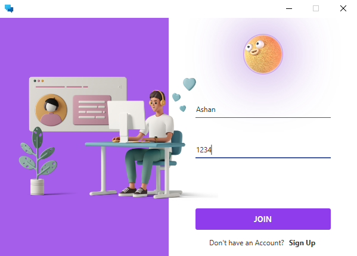
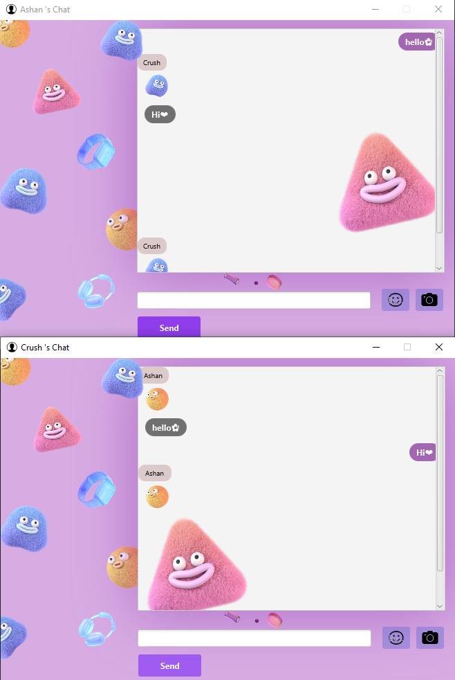

# Socket Programming(INP)-Live-Chat

Welcome to the Introduction to Network Programming project! This project is developed for Client-Server Chat Application using Socket Programming concepts

### Prerequisites

Before you begin, ensure you have met the following requirements:

- Java Development Kit 11 (JDK) installed.
- Integrated Development Environment (IDE) like IntelliJ IDEA or Eclipse.
- Git for version control.
- MySQL or another relational database management system installed.

-📌JavaFX: A framework for building desktop applications with a rich user interface.
-📌Socket Programming: Utilized for network communication between the client and server components.
-📌Multi-Threading: Implemented to handle concurrent communication between multiple clients and the server.
-📌JFoenix: A JavaFX library providing stylized buttons and UI components.

### Database Setup

1. **Create Database:**
   Open your preferred MySQL client and execute the following SQL command to create the "Vchat" database:

   ```sql
   CREATE DATABASE IF NOT EXISTS Vchat;
   ```
### Get SQL QUERY
   src/main/resources/databse.sql

3. **Run SQL Script:**
   Locate the SQL file named `init_database.sql` in the `resources` folder. Run this script in your MySQL client to initialize the database with required tables and data.

## Usage

To run the project, follow these steps:

1. Open the project in your IDE.
2. Build and run the application.

## Project View Sample
#### LOGIN PREVIEW


#### REGISTER PREVIEW


#### CHAT PREVIEW



